# 多平台内容抓取、AI 编排与发布平台详细设计文档

## 1. 文档说明

- 文档状态：更新中
- 更新时间：2026-03-20
- 关联文档：`docs/需求文档.md`
- 适用阶段：MVP 已完成，当前面向增强阶段设计
- 文档目标：将需求文档细化为可实现的系统设计，覆盖多账号抓取、AI 模型接入、分类标签、报告生成、多平台发布、Telegram 订阅等增强能力的架构设计、功能设计、数据模型、实体关系模型、接口设计和关键流程

## 2. 设计目标与边界

### 2.1 设计目标

1. 支持用户登录平台并绑定多个可用的 X 账号。
2. 支持按账号和抓取策略执行推荐、热点、自定义搜索三种模式的内容拉取。
3. 支持按“用户 + 平台 + 平台帖子唯一标识”去重归档，同时记录多次命中来源。
4. 支持将帖子转换为富文本并在系统内长期存档。
5. 支持为归档帖子增加单分类与多标签，并区分 AI 结果与人工修正。
6. 支持接入多个 AI 服务提供商，并为分类、报告、润色等任务选择模型。
7. 支持生成周报、月报，并支持人工编辑后向多个平台发布。
8. 支持 Telegram 订阅投递。

### 2.2 非目标

1. 本阶段不追求覆盖所有第三方平台，优先支持 X 抓取与微信公众号、知乎、CSDN、Telegram 等重点渠道。
2. 本阶段不包含多人协作、审批流和组织空间。
3. 本阶段不包含面向第三方的开放 API。
4. 本阶段不实现自研大模型训练，仅接入外部模型服务。

### 2.3 关键设计假设

1. 前端采用 Next.js，负责页面渲染、用户会话和 BFF 层认证转发。
2. 后端采用 NestJS，负责业务 API、任务调度、抓取执行、归档处理和数据访问。
3. 数据库使用 PostgreSQL，ORM 使用 Prisma。
4. 认证基于 NextAuth.js，用户体系与业务数据共用同一 PostgreSQL。
5. X 推荐流抓取依赖登录态，因此系统使用可插拔的“浏览器辅助绑定 + 抓取适配器”设计。
6. AI 调用通过统一 AI Gateway 抽象，并对不同提供商使用适配器模式封装。
7. 发布目标平台通过渠道适配器抽象，后续可逐步扩展。
8. 生产部署推荐为“Next.js on Vercel + NestJS Worker/API on Docker + PostgreSQL on Neon”。

## 3. 总体架构设计

### 3.1 逻辑架构

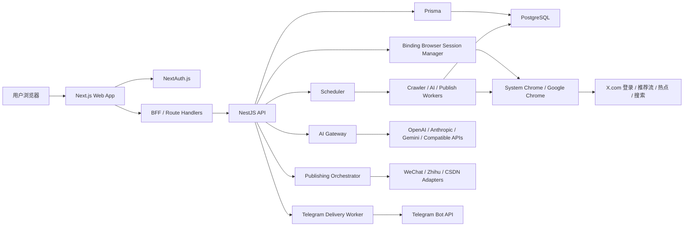

### 3.2 分层说明

1. 表现层：Next.js 页面、ShadCN UI 组件、Tailwind CSS 样式、客户端状态管理。
2. 接入层：Next.js Middleware 与 Route Handlers，负责会话校验、BFF 转发和页面保护。
3. 业务层：NestJS 的绑定管理、浏览器绑定会话管理、抓取调度、归档管理、分类标签、AI 模型管理、报告管理、发布管理、订阅管理、任务记录、仪表盘统计模块。
4. 数据层：Prisma + PostgreSQL，保存认证数据、业务实体、任务记录、归档内容、AI 任务、报告、发布记录和审计信息。
5. 异步执行层：NestJS Scheduler 或队列 Worker，负责定时扫描、抓取执行、AI 分类、报告生成、发布投递和 Telegram 推送。

### 3.3 技术决策

#### 3.3.1 认证与权限

1. NextAuth.js 负责用户登录、会话维持与页面访问保护。
2. Next.js 服务端在获取到登录会话后，将当前用户身份通过内部受信方式传递给 NestJS。
3. NestJS 仅信任来自受控 BFF 的内部请求头或内部签名 Token，不直接暴露匿名业务接口。

#### 3.3.2 抓取执行

1. 定时扫描由 NestJS 负责，避免将长任务放在 Vercel Serverless 中执行。
2. 抓取过程拆分为“任务选择 -> 抓取执行 -> 标准化解析 -> 去重写入 -> 结果汇总”五个阶段。
3. 抓取适配器采用接口抽象，方便后续替换为不同实现方式。

#### 3.3.3 去重策略

1. MVP 阶段数据库层通过 `unique(binding_id, x_post_id)` 做强约束。
2. 增强阶段将演进为 `unique(user_id, source_platform, source_post_id)`。
3. 业务层在写入前先查询，写入时再依赖唯一约束兜底，保证并发场景下仍不会重复。
4. 每次抓取无论新增还是跳过，都会生成对应的处理记录。

#### 3.3.4 富文本归档

1. 归档主数据保存原始文本、结构化富文本 JSON、渲染后 HTML 和原始载荷 JSON。
2. 前端优先使用结构化 JSON 渲染，HTML 作为降级展示或调试用途。
3. 所有 HTML 内容必须经过服务端清洗，防止 XSS。

#### 3.3.5 AI 服务抽象

1. 后端提供统一 `AI Gateway`，向上暴露统一调用接口，例如 `classifyPost`、`generateReport`、`rewriteDraft`。
2. 每个 AI 提供商通过适配器接入，统一处理鉴权、超时、重试、响应解析和成本统计。
3. 用户可在任务级选择默认模型，任务执行时记录模型版本、参数和输出快照。

#### 3.3.6 多平台发布抽象

1. 外部平台发布通过 `PublishingChannelAdapter` 抽象，统一定义 `validateCredential`、`publishDraft`、`syncPublishedMetadata` 等方法。
2. 不同平台的正文结构差异通过渠道渲染器处理，例如微信公众号富文本、知乎 Markdown/HTML、CSDN 博文格式。
3. 发布失败后保留草稿与任务记录，支持重试。

#### 3.3.7 去重策略演进

1. 当前已实现的 `bindingId + xPostId` 去重仅适用于单账号 MVP。
2. 增强阶段改为 `userId + sourcePlatform + sourcePostId` 作为归档主唯一键。
3. 同一帖子被多个账号或模式命中时，通过 `archive_occurrences` 记录来源，而不是重复创建归档主记录。

### 3.4 前端体验与偏好设计

#### 3.4.1 用户可见文案策略

1. 首页与主要导航页面采用产品说明型文案，优先解释“能做什么、适合谁、为什么可信”。
2. 面向用户的页面不展示研发进度、里程碑推进、内部实施计划等开发态信息。
3. 首页信息结构默认包含：核心功能卡片、产品能力摘要、技术栈说明。

#### 3.4.2 Header 信息架构

1. Header 分为两层：
   第一层展示品牌信息与工具控件。
   第二层展示主导航标签。
2. 工具控件包括语言切换与亮暗主题切换，独立放置于右侧，避免挤占导航空间。
3. 主导航标签使用“胶囊按钮 + 持续选中底色”方案，当前页在刷新和路由切换后都应保持高亮。

#### 3.4.3 国际化设计

1. 前端语言偏好通过 Cookie 持久化，默认语言为 `zh-CN`，同时支持 `en`。
2. 语言切换在当前页面即时更新，不使用语言前缀路由。
3. 服务端页面通过读取 Cookie 决定文案语言，客户端切换控件写入 Cookie 后触发页面刷新。

#### 3.4.4 主题设计

1. 前端主题偏好通过 Cookie 持久化，支持 `light` 与 `dark` 两种模式。
2. 服务端根布局根据主题 Cookie 输出 `html.dark` 类名，确保刷新后仍保持正确主题。
3. 客户端主题切换控件直接更新 Cookie 与 `document.documentElement` 的主题类，实现即时切换。
4. 页面壳子、导航、通用状态组件和常见卡片色板需统一适配双主题。

## 4. 模块设计

### 4.1 用户登录与权限模块

#### 4.1.1 目标

1. 提供稳定的登录能力。
2. 保护系统内需要登录后访问的页面和接口。
3. 让用户与绑定账号、任务记录、归档内容形成清晰的数据隔离。

#### 4.1.2 前端设计

1. 页面路径：`/login`
2. 组件组成：登录卡片、登录方式入口、错误提示、登录中状态
3. 受保护页面：`/dashboard`、`/bindings`、`/archives`、`/runs`
4. 未登录访问受保护页面时，Next.js Middleware 重定向到登录页

#### 4.1.3 后端设计

1. NestJS 不单独维护登录页。
2. NestJS 接收由 BFF 透传的用户身份，例如 `x-user-id`、`x-user-role` 和内部签名头。
3. 所有业务查询必须带 `userId` 过滤条件，禁止依赖前端传入的任意用户 ID。

#### 4.1.4 权限规则

1. 用户只能读取和修改自己的绑定账号。
2. 用户只能查看自己的抓取任务与归档内容。
3. 管理员角色暂时只做数据模型预留，不在 MVP 页面开放。

### 4.2 X 账号绑定模块

#### 4.2.1 目标

1. 建立平台用户与 X 账号之间的绑定关系。
2. 持久化保存抓取所需的最小凭证集合。
3. 支持绑定状态校验、失效标记和重新绑定。

#### 4.2.2 页面设计

页面路径：`/bindings`

页面结构：

1. X 账号绑定列表
2. 当前绑定状态展示区
3. 浏览器辅助绑定入口
4. 浏览器绑定会话状态区
5. 策略中心跳转卡片
6. “立即抓取”按钮
7. 重新校验按钮
8. 解绑按钮

空状态：

1. 未绑定时展示“通过浏览器登录并绑定 X 账号”主按钮
2. 展示绑定说明、风险提示和最小权限说明

#### 4.2.3 交互流程

1. 用户点击“通过浏览器登录并绑定 X 账号”。
2. 后端创建浏览器绑定会话，并拉起真实 Chrome 可视窗口；在 Docker 场景下通过 noVNC 远程桌面暴露该窗口。
3. 浏览器自动跳转到 `https://x.com/i/flow/login`。
4. 用户在该窗口内手动完成登录。
5. 前端轮询绑定会话状态。
6. 后端检测到登录成功后，自动提取 Cookie、`auth_token`、`ct0` 和当前账号基础信息。
7. 后端调用绑定服务创建或更新绑定记录。
8. 系统返回绑定成功状态与基础账号信息。

#### 4.2.4 状态设计

绑定状态 `BindingStatus`：

1. `PENDING`：已提交凭证，尚未完成校验
2. `ACTIVE`：校验通过，可执行抓取
3. `INVALID`：凭证失效或校验失败
4. `DISABLED`：用户主动停用或解绑

#### 4.2.5 业务规则

1. 增强阶段每个用户允许存在多个激活中的 X 绑定账号。
2. 若重复绑定同一个 X 账号，则更新该绑定的凭证与资料，而不是创建重复记录。
3. 绑定凭证必须加密后再保存。
4. 每次抓取失败若判断为凭证失效，需回写 `INVALID` 状态。
5. 浏览器绑定会话默认 10 分钟超时，超时后需重新发起。

### 4.3 抓取配置与调度模块

#### 4.3.1 目标

1. 支持自动抓取和手动抓取两种触发方式。
2. 支持定时扫描到期任务并创建抓取执行记录。
3. 保证同一绑定账号在同一时刻只有一个运行中的任务。

#### 4.3.2 页面设计

抓取配置位于独立 `/strategies` 页面内，按绑定账号维度组织。字段包括：

1. 左侧账号列表与当前选中账号态
2. 当前账号的抓取策略列表
3. 新建策略按钮与配置弹窗
4. 抓取模式 `mode`
5. 自动抓取开关 `enabled`
6. 调度模式 `scheduleKind`
7. 可视化周期配置：分钟间隔、按小时、按天、按周、自定义 Cron
8. 搜索条件 `queryText`（仅搜索模式）
9. 热点范围参数 `region / language`（仅热点模式）
10. 最近抓取时间 `lastRunAt`
11. 下一次执行时间 `nextRunAt`

#### 4.3.3 调度设计

1. NestJS Scheduler 每分钟扫描一次到期任务。
2. 查询条件：`crawl_profiles.enabled = true` 且 `crawl_profiles.next_run_at <= now()`
3. 调度层使用数据库锁或业务锁防止重复领取任务。
4. 任务被领取后创建一条 `crawl_runs` 记录，状态置为 `QUEUED`
5. Worker 开始执行后将状态更新为 `RUNNING`

#### 4.3.4 并发控制

1. 同一 `binding_id` 同时只允许一个 `RUNNING` 或 `QUEUED` 任务。
2. 并发控制采用以下组合策略：调度查询使用 `FOR UPDATE SKIP LOCKED`、`crawl_profiles` 表维护 `lastRunAt` 和 `nextRunAt`、Worker 启动时再次校验是否已有运行中任务。

#### 4.3.5 下一次执行时间计算

1. `scheduleKind = INTERVAL` 时：`nextRunAt = now() + intervalMinutes`
2. `scheduleKind = CRON` 时：根据 Cron 表达式计算下一次执行时间
3. 部分失败后：仍按正常周期推进，但记录错误摘要
4. 账号失效时：暂停自动抓取，并将 `nextRunAt` 置空

### 4.4 抓取执行模块

#### 4.4.1 目标

1. 从 X 推荐流中拉取帖子原始数据。
2. 将原始结果标准化为内部统一结构。
3. 对每一条帖子执行去重判断与归档。

#### 4.4.2 执行步骤

1. 读取绑定凭证并解密。
2. 初始化抓取适配器实例。
3. 通过 Playwright 连接系统 Chrome，并创建带登录态 Cookie 的浏览器上下文。
4. 打开 `https://x.com/home` 并等待推荐流内容渲染。
5. 抓取当前可见推荐流帖子 DOM，构造成原始帖子数组。
6. 对响应内容进行标准化，得到统一 `NormalizedPost` 列表。
7. 逐条写入 `crawl_run_posts` 处理记录。
8. 新帖子写入归档表，已存在帖子标记为 `SKIPPED`。
9. 汇总本次执行结果并更新 `crawl_runs`。

#### 4.4.3 适配器接口

抓取适配器建议抽象为以下接口：

```ts
interface FeedCrawlerAdapter {
  validateCredential(payload: EncryptedCredential): Promise<BindingProfile>;
  fetchRecommendedFeed(payload: EncryptedCredential): Promise<RawFeedResponse>;
  normalizePosts(raw: RawFeedResponse): Promise<NormalizedPost[]>;
}
```

真实适配器补充设计：

1. `validateCredential`：用登录态 Cookie 打开 `x.com/home`，确认未跳转回登录流程。
2. `fetchRecommendedFeed`：抓取 `article[data-testid="tweet"]` 等可见 DOM 节点并提取帖子结构。
3. 绑定阶段优先使用真实 Chrome 进程并通过 CDP 接管，抓取阶段默认使用同一浏览器内核的 `headless` 上下文。
4. Docker 本地联调默认启用 noVNC 远程桌面，并建议 `api` 服务使用 `linux/amd64 + Google Chrome Stable` 组合，降低 Google 登录“浏览器不安全”拦截概率。

#### 4.4.4 `NormalizedPost` 统一结构

```ts
type NormalizedPost = {
  xPostId: string;
  postUrl: string;
  postType: "POST" | "REPOST" | "QUOTE" | "REPLY";
  author: {
    xUserId?: string;
    username: string;
    displayName?: string;
    avatarUrl?: string;
  };
  rawText: string;
  sourceCreatedAt: string;
  entities: {
    mentions: Array<{ username: string; start: number; end: number }>;
    hashtags: Array<{ tag: string; start: number; end: number }>;
    urls: Array<{
      url: string;
      displayUrl?: string;
      start: number;
      end: number;
    }>;
  };
  media: Array<{
    mediaType: "IMAGE" | "VIDEO" | "GIF";
    sourceUrl: string;
    previewUrl?: string;
    width?: number;
    height?: number;
    durationMs?: number;
  }>;
  relations: Array<{
    relationType: "QUOTE" | "REPOST" | "REPLY";
    targetXPostId?: string;
    targetUrl?: string;
    targetAuthorUsername?: string;
  }>;
  rawPayload: unknown;
};
```

### 4.5 去重与归档模块

#### 4.5.1 目标

1. 保证相同帖子不会被重复归档。
2. 保留每次抓取对帖子做出的处理结果。
3. 将帖子转换为系统统一的富文本结构。

#### 4.5.2 去重逻辑

1. 根据 `bindingId + xPostId` 查询是否存在归档记录。
2. 若不存在，则创建 `archived_posts` 主记录与关联媒体、关联关系记录。
3. 若存在，则本次 `crawl_run_posts` 标记为 `SKIPPED`，原因写入 `already_archived`。
4. 若并发写入时发生唯一约束冲突，则按已存在处理。

#### 4.5.3 富文本转换设计

内部统一富文本结构建议如下：

```json
{
  "version": 1,
  "blocks": [
    {
      "type": "paragraph",
      "children": [
        {
          "type": "text",
          "text": "示例文本"
        },
        {
          "type": "mention",
          "text": "@openai",
          "username": "openai"
        },
        {
          "type": "link",
          "text": "https://x.com",
          "href": "https://x.com"
        }
      ]
    },
    {
      "type": "media",
      "mediaRef": "media_1"
    }
  ]
}
```

#### 4.5.4 转换规则

1. 文本按段落和换行拆分。
2. `@提及` 转为 `mention` 节点。
3. `#标签` 转为 `hashtag` 节点。
4. 链接转为 `link` 节点。
5. 图片、视频、GIF 转为 `media` 块节点。
6. 引用帖、转发帖、回复关系转为 `relation` 摘要块。

#### 4.5.5 安全处理

1. `renderedHtml` 必须经过白名单清洗。
2. 原始文本与结构化 JSON 均保留，用于重建或重新渲染。
3. 不可信外链仅作为跳转目标，不内联执行第三方脚本。

### 4.6 归档浏览模块

#### 4.6.1 列表页设计

页面路径：`/archives`

页面区域：

1. 顶部筛选栏
2. 卡片列表区
3. 分页器
4. 空状态与错误状态

卡片字段：

1. 作者头像
2. 作者名与用户名
3. 帖子类型标签
4. 摘要文本
5. 媒体缩略图
6. 原始发布时间
7. 归档时间
8. 原文链接
9. 详情入口

#### 4.6.2 列表查询条件

1. `bindingId`
2. `keyword`
3. `postType`
4. `archivedFrom`
5. `archivedTo`
6. `page`
7. `pageSize`

#### 4.6.3 分页方案

1. MVP 使用页码分页，便于后台式页面实现。
2. 默认 `pageSize = 20`。
3. 后端返回 `total`、`page`、`pageSize`、`items`。

#### 4.6.4 详情页设计

页面路径：`/archives/[id]`

展示内容：

1. 作者信息
2. 帖子富文本全文
3. 媒体资源区
4. 帖子关系区
5. 原始来源信息
6. 首次归档任务信息

### 4.7 抓取记录模块

#### 4.7.1 页面设计

页面路径：`/runs`

列表字段：

1. 执行开始时间
2. 执行结束时间
3. 触发方式
4. 任务状态
5. 抓取总数
6. 新增数
7. 跳过数
8. 失败数
9. 错误摘要

#### 4.7.2 详情设计

页面路径：`/runs/[id]`

详情内容：

1. 任务基础信息
2. 绑定账号信息
3. 执行统计
4. 错误详情
5. 处理项列表

### 4.8 仪表盘模块

页面路径：`/dashboard`

展示内容：

1. 当前绑定账号状态
2. 最近一次抓取结果
3. 下一次抓取时间
4. 近 7 天抓取次数
5. 累计归档数量
6. 最近一次 AI 分类结果摘要
7. 最近一份周报或月报摘要

### 4.9 分类与标签模块

#### 4.9.1 目标

1. 为归档帖子提供单个主分类和多个标签。
2. 分类仅允许从人工维护的分类目录中选择，标签允许 AI 自动补充并自动创建缺失标签。
3. 归档侧只展示一套最终分类与标签结果，人工与 AI 共用同一套可编辑数据。
4. 让分类与标签可用于筛选、报告和订阅规则。

#### 4.9.2 页面设计

页面路径：`/archives`、`/archives/[id]`、`/settings/taxonomy`

页面能力：

1. 归档列表页支持按分类和标签筛选。
2. 归档详情页支持手动修改主分类、添加或删除标签。
3. 分类标签设置页支持新增、编辑、停用和排序。

#### 4.9.3 后端设计

1. `archived_posts` 增加 `primaryCategoryId`。
2. 标签使用 `tags + archived_post_tags` 多对多关系实现。
3. 归档详情与编辑接口以“最终结果集合”为语义，保存时直接替换当前标签集合。
4. `archived_post_tags.source` 可继续作为内部审计字段保留，但前端不展示来源差异。

### 4.10 AI 模型管理模块

#### 4.10.1 目标

1. 支持多个 AI 服务提供商。
2. 支持为不同任务指定默认模型。
3. 统一管理密钥、安全、连通性测试和调用审计。

#### 4.10.2 页面设计

页面路径：`/settings/ai`

页面能力：

1. 提供商列表管理。
2. 模型列表管理。
3. 默认任务模型配置。
4. 测试连接与最近调用状态查看。

#### 4.10.3 后端设计

1. 提供商配置表保存加密后的 API Key、Base URL、提供商类型。
2. 模型配置表保存模型编码、任务类型、启用状态和参数。
3. AI Gateway 运行时根据任务类型解析默认模型与回退策略。

### 4.11 AI 自动分类流水线

#### 4.11.1 触发时机

1. 新归档帖子创建后异步触发。
2. 用户手动点击“重新 AI 分类”时触发。
3. 模型切换或提示词升级后支持批量重跑。

#### 4.11.2 处理流程

1. 读取帖子正文、媒体摘要、作者信息与命中来源。
2. 调用分类模型返回主分类、标签、摘要和置信度。
3. 校验输出结构时，主分类仅允许命中现有分类；标签允许复用已有标签或触发自动建标。
4. 落库时若帖子标签未被锁定，则先替换当前标签集合，再写入新的 AI 结果。
5. 若任务失败，记录错误并允许后续重试。

#### 4.11.3 人工覆盖策略

1. 人工修改分类或标签后，将帖子标记为“手动锁定”。
2. 锁定后，后续自动 AI 任务默认不覆盖当前最终分类/标签集合，除非用户显式允许。

### 4.12 报告模块

#### 4.12.1 目标

1. 对周度、月度帖子进行汇总统计和 AI 总结。
2. 让报告可独立查看、编辑、再生成和发布。
3. 报告可作为 Telegram 订阅和内容发布的来源。

#### 4.12.2 页面设计

页面路径：`/reports`、`/reports/[id]`

页面能力：

1. 查看报告列表与周期筛选。
2. 生成周报、月报。
3. 编辑报告正文与标题。
4. 发起发布草稿或 Telegram 推送。

#### 4.12.3 后端设计

1. 报告生成先做结构化聚合，再调用 AI 模型生成自然语言总结。
2. 报告记录保存周期范围、汇总统计、富文本正文、AI 生成摘要和版本信息。
3. 报告与归档帖子通过关联表建立可追溯关系。

### 4.13 拉取模式与抓取配置模块

#### 4.13.1 模式定义

1. `RECOMMENDED`：抓取首页推荐流。
2. `HOT`：抓取热点流或趋势流。
3. `SEARCH`：根据用户自定义搜索条件抓取结果。

#### 4.13.2 配置设计

1. 每个 X 绑定可创建多个 `crawl_profiles`。
2. 每个 `crawl_profile` 独立维护调度参数、查询参数与启停状态。
3. 每次执行记录需要回写对应的 `crawl_profile_id` 与模式快照。

#### 4.13.3 适配器演进

增强版抓取适配器接口建议升级为：

```ts
interface FeedCrawlerAdapterV2 {
  validateCredential(payload: EncryptedCredential): Promise<BindingProfile>;
  fetchFeed(
    payload: EncryptedCredential,
    profile: CrawlProfileSnapshot,
  ): Promise<RawFeedResponse>;
  normalizePosts(raw: RawFeedResponse): Promise<NormalizedPost[]>;
}
```

### 4.14 多平台绑定与多账号管理模块

#### 4.14.1 目标

1. 统一管理多个 X 抓取源账号。
2. 支持微信公众号、知乎、CSDN 等发布渠道绑定。
3. 为后续新增平台提供统一扩展点。

#### 4.14.2 页面设计

页面路径：`/bindings`

页面区域：

1. X 抓取源账号列表
2. 发布渠道列表
3. 每个绑定项的状态、能力、最近校验时间
4. 新增绑定、重新授权、停用、解绑入口

#### 4.14.3 设计原则

1. 抓取源绑定与发布渠道绑定在领域上分离，但可共用统一的凭证加密与校验框架。
2. 每个绑定项需声明平台类型与能力集合。

### 4.15 内容编辑与发布模块

#### 4.15.1 目标

1. 让归档帖子和报告可转化为发布草稿。
2. 支持人工编辑后向多个平台一键发布。
3. 保留发布记录、平台回执与失败重试能力。

#### 4.15.2 页面设计

页面路径：`/publishing`、`/publishing/drafts/[id]`

页面能力：

1. 草稿列表与状态筛选。
2. 富文本编辑器与平台预览。
3. 目标平台选择器。
4. 发布历史与失败重试。

#### 4.15.3 后端设计

1. 发布草稿主表保存统一富文本内容。
2. 渠道渲染器将统一富文本转换为平台可接受的格式。
3. 发布任务按“草稿 + 渠道”拆分，分别记录结果。

### 4.16 Telegram 订阅模块

#### 4.16.1 目标

1. 支持把新增归档、周报、月报推送到 Telegram。
2. 支持按分类、标签、账号、频率配置订阅规则。

#### 4.16.2 页面设计

页面路径：`/subscriptions`

页面能力：

1. 订阅目标配置。
2. 推送内容类型配置。
3. 频率配置。
4. 最近投递记录查看。

#### 4.16.3 后端设计

1. 订阅规则保存到 `telegram_subscriptions`。
2. 投递 Worker 根据规则拉取待投递内容并调用 Telegram Bot API。
3. 每次投递结果写入投递日志表，供 UI 查询与重试。

## 5. 关键流程设计

### 5.1 绑定流程

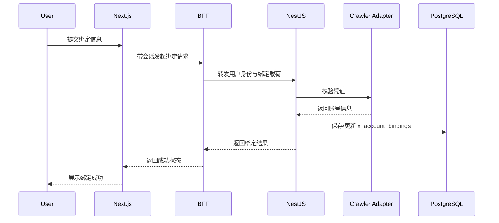

### 5.2 定时抓取流程

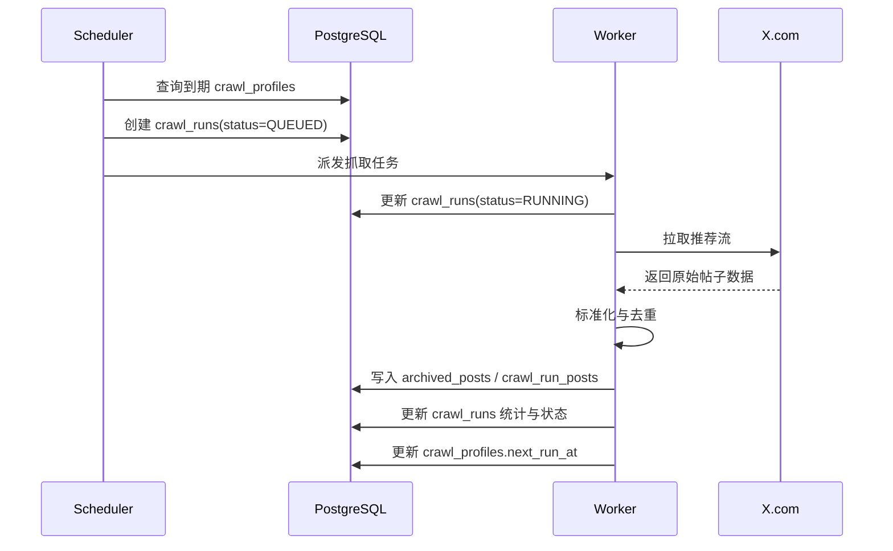

### 5.3 归档详情查询流程

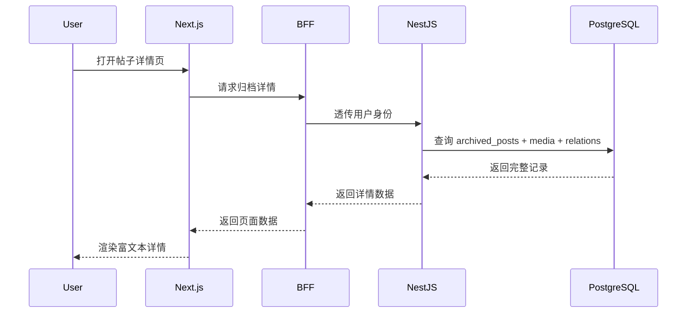

### 5.4 AI 分类流程

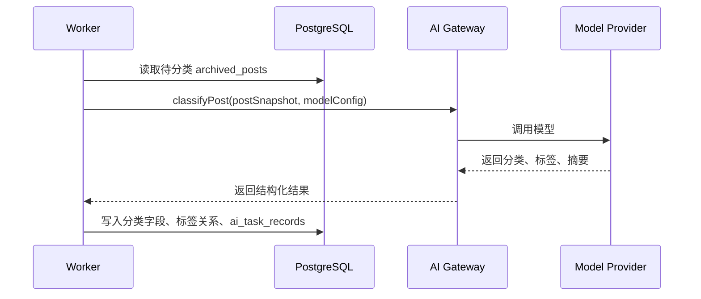

### 5.5 周报月报生成流程

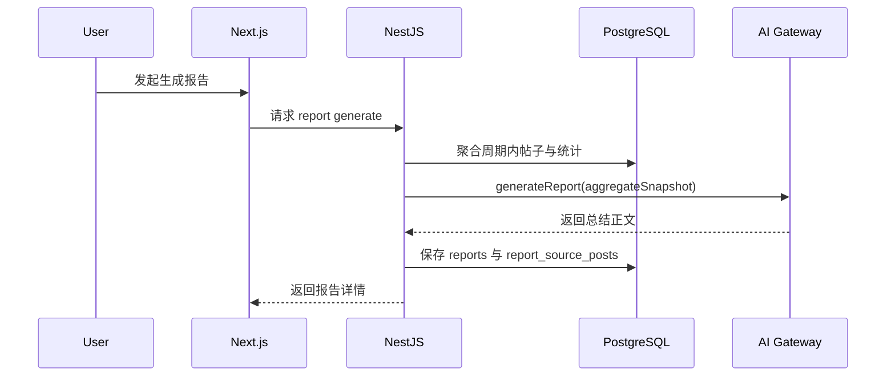

### 5.6 发布流程

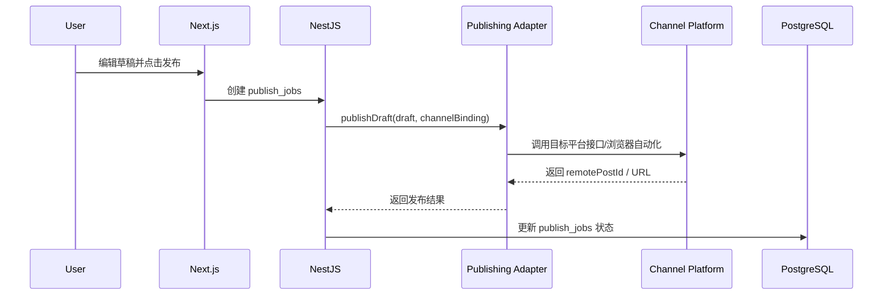

### 5.7 Telegram 投递流程

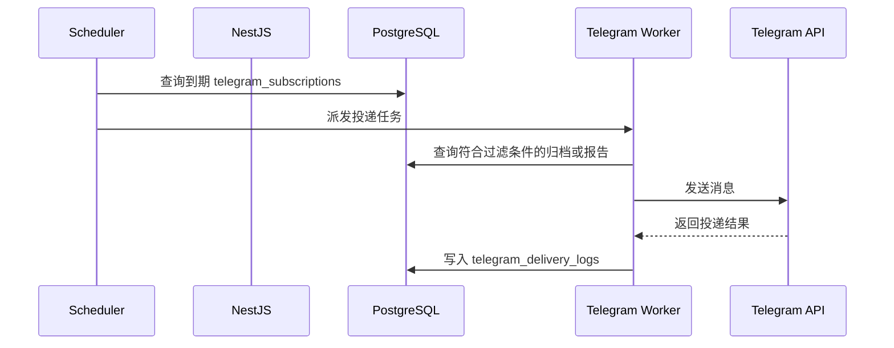

## 6. 接口设计

### 6.1 前端页面路由

1. `/login`：登录页
2. `/dashboard`：仪表盘
3. `/bindings`：X 账号绑定、多平台渠道绑定与抓取配置页
4. `/archives`：归档列表页
5. `/archives/[id]`：归档详情页
6. `/runs`：抓取记录页
7. `/runs/[id]`：抓取记录详情页
8. `/settings/taxonomy`：分类与标签管理页
9. `/settings/ai`：AI 模型配置页
10. `/reports`：报告中心
11. `/reports/[id]`：报告详情页
12. `/publishing`：发布中心
13. `/publishing/drafts/[id]`：发布草稿详情页
14. `/subscriptions`：Telegram 订阅页

### 6.2 BFF 到 NestJS API 一览

| 方法    | 路径                                          | 说明                 |
| ------- | --------------------------------------------- | -------------------- |
| `GET`   | `/api/dashboard/summary`                      | 获取仪表盘统计       |
| `GET`   | `/api/bindings`                               | 获取当前用户全部绑定 |
| `POST`  | `/api/bindings`                               | 创建或更新绑定       |
| `POST`  | `/api/bindings/:id/validate`                  | 重新校验绑定         |
| `POST`  | `/api/bindings/:id/disable`                   | 停用绑定             |
| `PATCH` | `/api/bindings/:id/crawl-profiles/:profileId` | 更新抓取配置         |
| `POST`  | `/api/bindings/:id/crawl-now`                 | 手动触发抓取         |
| `GET`   | `/api/archives`                               | 获取归档分页列表     |
| `GET`   | `/api/archives/:id`                           | 获取归档详情         |
| `PATCH` | `/api/archives/:id/taxonomy`                  | 更新分类与标签       |
| `POST`  | `/api/archives/:id/ai-classify`               | 手动触发 AI 分类     |
| `GET`   | `/api/runs`                                   | 获取任务记录列表     |
| `GET`   | `/api/runs/:id`                               | 获取任务记录详情     |
| `GET`   | `/api/taxonomy/categories`                    | 获取分类列表         |
| `GET`   | `/api/taxonomy/tags`                          | 获取标签列表         |
| `POST`  | `/api/ai/providers`                           | 新增 AI 提供商       |
| `POST`  | `/api/ai/models`                              | 新增 AI 模型配置     |
| `POST`  | `/api/reports/generate`                       | 生成报告             |
| `GET`   | `/api/reports`                                | 获取报告列表         |
| `GET`   | `/api/reports/:id`                            | 获取报告详情         |
| `POST`  | `/api/publish/drafts`                         | 创建发布草稿         |
| `POST`  | `/api/publish/drafts/:id/publish`             | 一键发布             |
| `GET`   | `/api/subscriptions/telegram`                 | 获取 Telegram 订阅   |
| `POST`  | `/api/subscriptions/telegram`                 | 创建 Telegram 订阅   |

### 6.3 关键接口示例

#### 6.3.1 创建绑定

请求体：

```json
{
  "credentialSource": "WEB_LOGIN",
  "credentialPayload": "encrypted-or-raw-payload-from-collector",
  "profiles": [
    {
      "mode": "RECOMMENDED",
      "enabled": true,
      "intervalMinutes": 60
    },
    {
      "mode": "SEARCH",
      "enabled": true,
      "intervalMinutes": 120,
      "queryText": "AI agent"
    }
  ]
}
```

返回体：

```json
{
  "id": "binding_xxx",
  "status": "ACTIVE",
  "username": "demo_user",
  "displayName": "Demo User",
  "avatarUrl": "https://...",
  "profiles": [
    {
      "id": "profile_recommended",
      "mode": "RECOMMENDED",
      "enabled": true,
      "intervalMinutes": 60,
      "nextRunAt": "2026-03-18T13:00:00.000Z"
    }
  ]
}
```

#### 6.3.2 获取归档列表

查询参数：

```txt
page=1&pageSize=20&keyword=ai&postType=QUOTE
```

返回体：

```json
{
  "page": 1,
  "pageSize": 20,
  "total": 156,
  "items": [
    {
      "id": "post_001",
      "xPostId": "188888888888",
      "postType": "QUOTE",
      "authorUsername": "demo_user",
      "summaryText": "帖子摘要",
      "coverImage": "https://...",
      "sourceCreatedAt": "2026-03-18T10:20:00.000Z",
      "archivedAt": "2026-03-18T11:00:00.000Z"
    }
  ]
}
```

## 7. 数据库设计

### 7.1 实体清单

认证与用户实体：

1. `users`
2. `accounts`
3. `sessions`
4. `verification_tokens`

业务实体：

1. `x_account_bindings`
2. `crawl_profiles`
3. `crawl_runs`
4. `crawl_run_posts`
5. `archive_occurrences`
6. `archived_posts`
7. `archived_post_media`
8. `archived_post_relations`
9. `categories`
10. `tags`
11. `archived_post_tags`
12. `ai_provider_configs`
13. `ai_model_configs`
14. `ai_task_records`
15. `reports`
16. `report_source_posts`
17. `publish_channel_bindings`
18. `publish_drafts`
19. `publish_jobs`
20. `telegram_subscriptions`
21. `telegram_delivery_logs`
22. `audit_logs`

### 7.2 实体关系模型

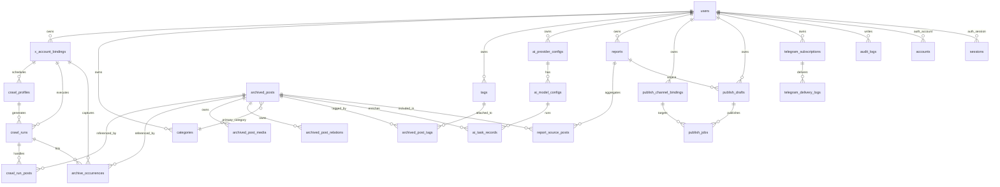

### 7.3 逻辑表设计

说明：`7.3.1` 到 `7.3.9` 主要描述当前 MVP 已落地的核心表；`7.3.10` 起补充增强阶段新增或演进的表设计。

#### 7.3.1 `users`

| 字段             | 类型        | 约束             | 说明             |
| ---------------- | ----------- | ---------------- | ---------------- |
| `id`             | `text`      | PK               | 用户 ID          |
| `name`           | `text`      | nullable         | 用户名称         |
| `email`          | `text`      | unique, nullable | 邮箱             |
| `email_verified` | `timestamp` | nullable         | 邮箱验证时间     |
| `image`          | `text`      | nullable         | 头像             |
| `role`           | `text`      | not null         | `USER` / `ADMIN` |
| `created_at`     | `timestamp` | not null         | 创建时间         |
| `updated_at`     | `timestamp` | not null         | 更新时间         |

#### 7.3.2 `x_account_bindings`

| 字段                     | 类型        | 约束           | 说明           |
| ------------------------ | ----------- | -------------- | -------------- |
| `id`                     | `text`      | PK             | 绑定 ID        |
| `user_id`                | `text`      | FK -> users.id | 所属用户       |
| `x_user_id`              | `text`      | not null       | X 用户 ID      |
| `username`               | `text`      | not null       | X 用户名       |
| `display_name`           | `text`      | nullable       | 显示名称       |
| `avatar_url`             | `text`      | nullable       | 头像           |
| `status`                 | `text`      | not null       | 绑定状态       |
| `credential_source`      | `text`      | not null       | 凭证来源       |
| `auth_payload_encrypted` | `text`      | not null       | 加密凭证       |
| `last_validated_at`      | `timestamp` | nullable       | 最近校验时间   |
| `crawl_enabled`          | `boolean`   | not null       | 是否启用抓取   |
| `crawl_interval_minutes` | `integer`   | not null       | 抓取周期       |
| `last_crawled_at`        | `timestamp` | nullable       | 最近抓取时间   |
| `next_crawl_at`          | `timestamp` | nullable       | 下一次抓取时间 |
| `last_error_message`     | `text`      | nullable       | 最近错误摘要   |
| `created_at`             | `timestamp` | not null       | 创建时间       |
| `updated_at`             | `timestamp` | not null       | 更新时间       |

索引建议：

1. `idx_x_account_bindings_user_id`
2. `idx_x_account_bindings_status`
3. `idx_x_account_bindings_next_crawl_at`

#### 7.3.3 `crawl_jobs`（兼容层）

| 字段               | 类型        | 约束       | 说明           |
| ------------------ | ----------- | ---------- | -------------- |
| `id`               | `text`      | PK         | 任务配置 ID    |
| `binding_id`       | `text`      | FK, unique | 对应绑定账号   |
| `enabled`          | `boolean`   | not null   | 是否启用       |
| `interval_minutes` | `integer`   | not null   | 周期           |
| `last_run_at`      | `timestamp` | nullable   | 最近执行时间   |
| `next_run_at`      | `timestamp` | nullable   | 下一次执行时间 |
| `created_at`       | `timestamp` | not null   | 创建时间       |
| `updated_at`       | `timestamp` | not null   | 更新时间       |

#### 7.3.4 `crawl_runs`

| 字段            | 类型        | 约束                        | 说明                                                |
| --------------- | ----------- | --------------------------- | --------------------------------------------------- |
| `id`            | `text`      | PK                          | 执行记录 ID                                         |
| `binding_id`    | `text`      | FK -> x_account_bindings.id | 所属绑定                                            |
| `crawl_job_id`  | `text`      | FK -> crawl_jobs.id         | 来源任务配置，增强阶段逐步迁移为 `crawl_profile_id` |
| `trigger_type`  | `text`      | not null                    | `MANUAL` / `SCHEDULED` / `RETRY`                    |
| `status`        | `text`      | not null                    | 执行状态                                            |
| `started_at`    | `timestamp` | nullable                    | 开始时间                                            |
| `finished_at`   | `timestamp` | nullable                    | 结束时间                                            |
| `fetched_count` | `integer`   | not null                    | 抓取总数                                            |
| `new_count`     | `integer`   | not null                    | 新增数                                              |
| `skipped_count` | `integer`   | not null                    | 跳过数                                              |
| `failed_count`  | `integer`   | not null                    | 失败数                                              |
| `error_message` | `text`      | nullable                    | 错误摘要                                            |
| `error_detail`  | `jsonb`     | nullable                    | 错误详情                                            |
| `created_at`    | `timestamp` | not null                    | 创建时间                                            |

索引建议：

1. `idx_crawl_runs_binding_id_created_at`
2. `idx_crawl_runs_status`

#### 7.3.5 `crawl_run_posts`

| 字段               | 类型        | 约束                              | 说明                             |
| ------------------ | ----------- | --------------------------------- | -------------------------------- |
| `id`               | `text`      | PK                                | 处理项 ID                        |
| `crawl_run_id`     | `text`      | FK -> crawl_runs.id               | 所属执行记录                     |
| `x_post_id`        | `text`      | not null                          | 帖子 ID                          |
| `archived_post_id` | `text`      | FK -> archived_posts.id, nullable | 归档引用                         |
| `action_type`      | `text`      | not null                          | `CREATED` / `SKIPPED` / `FAILED` |
| `reason`           | `text`      | nullable                          | 结果原因                         |
| `raw_payload_json` | `jsonb`     | nullable                          | 单条原始载荷                     |
| `created_at`       | `timestamp` | not null                          | 创建时间                         |

约束建议：

1. `unique(crawl_run_id, x_post_id)`

#### 7.3.6 `archived_posts`

| 字段                  | 类型        | 约束                          | 说明           |
| --------------------- | ----------- | ----------------------------- | -------------- |
| `id`                  | `text`      | PK                            | 归档主键       |
| `binding_id`          | `text`      | FK -> x_account_bindings.id   | 来源绑定       |
| `first_crawl_run_id`  | `text`      | FK -> crawl_runs.id, nullable | 首次归档任务   |
| `x_post_id`           | `text`      | not null                      | X 帖子 ID      |
| `post_url`            | `text`      | not null                      | 原文链接       |
| `post_type`           | `text`      | not null                      | 帖子类型       |
| `archive_status`      | `text`      | not null                      | 归档状态       |
| `author_x_user_id`    | `text`      | nullable                      | 作者 X 用户 ID |
| `author_username`     | `text`      | not null                      | 作者用户名     |
| `author_display_name` | `text`      | nullable                      | 作者显示名     |
| `author_avatar_url`   | `text`      | nullable                      | 作者头像       |
| `language`            | `text`      | nullable                      | 语言           |
| `raw_text`            | `text`      | not null                      | 原始文本       |
| `rich_text_json`      | `jsonb`     | not null                      | 富文本 JSON    |
| `rendered_html`       | `text`      | nullable                      | 清洗后的 HTML  |
| `raw_payload_json`    | `jsonb`     | not null                      | 原始载荷       |
| `source_created_at`   | `timestamp` | not null                      | 原文发布时间   |
| `archived_at`         | `timestamp` | not null                      | 归档时间       |
| `reply_count`         | `integer`   | nullable                      | 回复数         |
| `repost_count`        | `integer`   | nullable                      | 转发数         |
| `quote_count`         | `integer`   | nullable                      | 引用数         |
| `favorite_count`      | `integer`   | nullable                      | 点赞数         |
| `view_count`          | `bigint`    | nullable                      | 浏览数         |
| `created_at`          | `timestamp` | not null                      | 创建时间       |
| `updated_at`          | `timestamp` | not null                      | 更新时间       |

约束建议：

1. `unique(binding_id, x_post_id)`

索引建议：

1. `idx_archived_posts_binding_id_archived_at`
2. `idx_archived_posts_binding_id_source_created_at`
3. `idx_archived_posts_author_username`
4. `idx_archived_posts_post_type`

#### 7.3.7 `archived_post_media`

| 字段               | 类型        | 约束                    | 说明                      |
| ------------------ | ----------- | ----------------------- | ------------------------- |
| `id`               | `text`      | PK                      | 媒体记录 ID               |
| `archived_post_id` | `text`      | FK -> archived_posts.id | 所属帖子                  |
| `media_type`       | `text`      | not null                | `IMAGE` / `VIDEO` / `GIF` |
| `source_url`       | `text`      | not null                | 原始资源地址              |
| `preview_url`      | `text`      | nullable                | 缩略图                    |
| `width`            | `integer`   | nullable                | 宽度                      |
| `height`           | `integer`   | nullable                | 高度                      |
| `duration_ms`      | `integer`   | nullable                | 时长                      |
| `sort_order`       | `integer`   | not null                | 排序                      |
| `created_at`       | `timestamp` | not null                | 创建时间                  |

#### 7.3.8 `archived_post_relations`

| 字段                     | 类型        | 约束                    | 说明                         |
| ------------------------ | ----------- | ----------------------- | ---------------------------- |
| `id`                     | `text`      | PK                      | 关系记录 ID                  |
| `archived_post_id`       | `text`      | FK -> archived_posts.id | 所属帖子                     |
| `relation_type`          | `text`      | not null                | `QUOTE` / `REPOST` / `REPLY` |
| `target_x_post_id`       | `text`      | nullable                | 关联帖 ID                    |
| `target_url`             | `text`      | nullable                | 关联帖链接                   |
| `target_author_username` | `text`      | nullable                | 关联作者用户名               |
| `snapshot_json`          | `jsonb`     | nullable                | 关联摘要快照                 |
| `created_at`             | `timestamp` | not null                | 创建时间                     |

#### 7.3.9 `audit_logs`

| 字段          | 类型        | 约束           | 说明     |
| ------------- | ----------- | -------------- | -------- |
| `id`          | `text`      | PK             | 审计 ID  |
| `user_id`     | `text`      | FK -> users.id | 操作用户 |
| `action`      | `text`      | not null       | 操作类型 |
| `entity_type` | `text`      | not null       | 实体类型 |
| `entity_id`   | `text`      | not null       | 实体 ID  |
| `metadata`    | `jsonb`     | nullable       | 附加信息 |
| `created_at`  | `timestamp` | not null       | 创建时间 |

#### 7.3.10 `crawl_profiles`

| 字段               | 类型        | 约束                        | 说明                             |
| ------------------ | ----------- | --------------------------- | -------------------------------- |
| `id`               | `text`      | PK                          | 抓取策略 ID                      |
| `binding_id`       | `text`      | FK -> x_account_bindings.id | 所属 X 绑定                      |
| `mode`             | `text`      | not null                    | `RECOMMENDED` / `HOT` / `SEARCH` |
| `enabled`          | `boolean`   | not null                    | 是否启用                         |
| `interval_minutes` | `integer`   | not null                    | 抓取周期                         |
| `query_text`       | `text`      | nullable                    | 搜索词                           |
| `region`           | `text`      | nullable                    | 热点区域                         |
| `language`         | `text`      | nullable                    | 内容语言                         |
| `max_posts`        | `integer`   | not null                    | 单次抓取上限                     |
| `last_run_at`      | `timestamp` | nullable                    | 最近执行时间                     |
| `next_run_at`      | `timestamp` | nullable                    | 下次执行时间                     |
| `created_at`       | `timestamp` | not null                    | 创建时间                         |
| `updated_at`       | `timestamp` | not null                    | 更新时间                         |

索引建议：

1. `idx_crawl_profiles_binding_id`
2. `idx_crawl_profiles_enabled_next_run_at`

#### 7.3.11 `archive_occurrences`

| 字段                  | 类型        | 约束                        | 说明               |
| --------------------- | ----------- | --------------------------- | ------------------ |
| `id`                  | `text`      | PK                          | 命中记录 ID        |
| `archived_post_id`    | `text`      | FK -> archived_posts.id     | 对应归档帖子       |
| `binding_id`          | `text`      | FK -> x_account_bindings.id | 来源账号           |
| `crawl_profile_id`    | `text`      | FK -> crawl_profiles.id     | 来源抓取策略       |
| `crawl_run_id`        | `text`      | FK -> crawl_runs.id         | 来源抓取任务       |
| `source_post_id`      | `text`      | not null                    | 平台帖子 ID        |
| `query_text_snapshot` | `text`      | nullable                    | 命中时搜索条件快照 |
| `created_at`          | `timestamp` | not null                    | 创建时间           |

#### 7.3.12 `categories`

| 字段          | 类型        | 约束           | 说明         |
| ------------- | ----------- | -------------- | ------------ |
| `id`          | `text`      | PK             | 分类 ID      |
| `user_id`     | `text`      | FK -> users.id | 所属用户     |
| `name`        | `text`      | not null       | 分类名称     |
| `slug`        | `text`      | not null       | 唯一标识     |
| `description` | `text`      | nullable       | 描述         |
| `color`       | `text`      | nullable       | 展示色       |
| `is_system`   | `boolean`   | not null       | 是否系统内置 |
| `sort_order`  | `integer`   | not null       | 排序         |
| `created_at`  | `timestamp` | not null       | 创建时间     |
| `updated_at`  | `timestamp` | not null       | 更新时间     |

约束建议：

1. `unique(user_id, slug)`

#### 7.3.13 `tags`

| 字段         | 类型        | 约束           | 说明         |
| ------------ | ----------- | -------------- | ------------ |
| `id`         | `text`      | PK             | 标签 ID      |
| `user_id`    | `text`      | FK -> users.id | 所属用户     |
| `name`       | `text`      | not null       | 标签名称     |
| `slug`       | `text`      | not null       | 唯一标识     |
| `color`      | `text`      | nullable       | 展示色       |
| `is_system`  | `boolean`   | not null       | 是否系统内置 |
| `created_at` | `timestamp` | not null       | 创建时间     |
| `updated_at` | `timestamp` | not null       | 更新时间     |

约束建议：

1. `unique(user_id, slug)`

#### 7.3.14 `archived_post_tags`

| 字段               | 类型        | 约束                    | 说明                     |
| ------------------ | ----------- | ----------------------- | ------------------------ |
| `id`               | `text`      | PK                      | 关系 ID                  |
| `archived_post_id` | `text`      | FK -> archived_posts.id | 帖子 ID                  |
| `tag_id`           | `text`      | FK -> tags.id           | 标签 ID                  |
| `source`           | `text`      | not null                | `MANUAL` / `AI` / `RULE` |
| `confidence`       | `numeric`   | nullable                | AI 置信度                |
| `created_at`       | `timestamp` | not null                | 创建时间                 |

约束建议：

1. `unique(archived_post_id, tag_id, source)`

#### 7.3.15 `ai_provider_configs`

| 字段                | 类型        | 约束           | 说明                                                    |
| ------------------- | ----------- | -------------- | ------------------------------------------------------- |
| `id`                | `text`      | PK             | 提供商配置 ID                                           |
| `user_id`           | `text`      | FK -> users.id | 所属用户                                                |
| `provider_type`     | `text`      | not null       | `OPENAI` / `ANTHROPIC` / `GEMINI` / `OPENAI_COMPATIBLE` |
| `name`              | `text`      | not null       | 展示名称                                                |
| `base_url`          | `text`      | nullable       | Base URL                                                |
| `api_key_encrypted` | `text`      | not null       | 加密密钥                                                |
| `enabled`           | `boolean`   | not null       | 是否启用                                                |
| `created_at`        | `timestamp` | not null       | 创建时间                                                |
| `updated_at`        | `timestamp` | not null       | 更新时间                                                |

#### 7.3.16 `ai_model_configs`

| 字段                 | 类型        | 约束                         | 说明                                                 |
| -------------------- | ----------- | ---------------------------- | ---------------------------------------------------- |
| `id`                 | `text`      | PK                           | 模型配置 ID                                          |
| `provider_config_id` | `text`      | FK -> ai_provider_configs.id | 所属提供商                                           |
| `model_code`         | `text`      | not null                     | 模型编码                                             |
| `display_name`       | `text`      | not null                     | 模型名称                                             |
| `task_type`          | `text`      | not null                     | `POST_CLASSIFY` / `REPORT_SUMMARY` / `DRAFT_REWRITE` |
| `enabled`            | `boolean`   | not null                     | 是否启用                                             |
| `parameters_json`    | `jsonb`     | nullable                     | 温度等参数                                           |
| `created_at`         | `timestamp` | not null                     | 创建时间                                             |
| `updated_at`         | `timestamp` | not null                     | 更新时间                                             |

#### 7.3.17 `ai_task_records`

| 字段                   | 类型        | 约束                      | 说明                                         |
| ---------------------- | ----------- | ------------------------- | -------------------------------------------- |
| `id`                   | `text`      | PK                        | AI 任务记录 ID                               |
| `user_id`              | `text`      | FK -> users.id            | 所属用户                                     |
| `task_type`            | `text`      | not null                  | 任务类型                                     |
| `target_type`          | `text`      | not null                  | `ARCHIVED_POST` / `REPORT` / `PUBLISH_DRAFT` |
| `target_id`            | `text`      | not null                  | 目标 ID                                      |
| `model_config_id`      | `text`      | FK -> ai_model_configs.id | 使用模型                                     |
| `status`               | `text`      | not null                  | `PENDING` / `RUNNING` / `SUCCESS` / `FAILED` |
| `input_snapshot_json`  | `jsonb`     | nullable                  | 输入快照                                     |
| `output_snapshot_json` | `jsonb`     | nullable                  | 输出快照                                     |
| `error_message`        | `text`      | nullable                  | 错误信息                                     |
| `created_at`           | `timestamp` | not null                  | 创建时间                                     |
| `updated_at`           | `timestamp` | not null                  | 更新时间                                     |

#### 7.3.18 `reports`

| 字段             | 类型        | 约束           | 说明                           |
| ---------------- | ----------- | -------------- | ------------------------------ |
| `id`             | `text`      | PK             | 报告 ID                        |
| `user_id`        | `text`      | FK -> users.id | 所属用户                       |
| `report_type`    | `text`      | not null       | `WEEKLY` / `MONTHLY` / `DAILY` |
| `title`          | `text`      | not null       | 报告标题                       |
| `period_start`   | `timestamp` | not null       | 周期开始                       |
| `period_end`     | `timestamp` | not null       | 周期结束                       |
| `rich_text_json` | `jsonb`     | not null       | 富文本内容                     |
| `rendered_html`  | `text`      | nullable       | 渲染 HTML                      |
| `summary_json`   | `jsonb`     | nullable       | 统计摘要                       |
| `status`         | `text`      | not null       | `DRAFT` / `READY` / `FAILED`   |
| `created_at`     | `timestamp` | not null       | 创建时间                       |
| `updated_at`     | `timestamp` | not null       | 更新时间                       |

#### 7.3.19 `report_source_posts`

| 字段               | 类型        | 约束                    | 说明        |
| ------------------ | ----------- | ----------------------- | ----------- |
| `id`               | `text`      | PK                      | 关系 ID     |
| `report_id`        | `text`      | FK -> reports.id        | 报告 ID     |
| `archived_post_id` | `text`      | FK -> archived_posts.id | 来源帖子 ID |
| `weight_score`     | `numeric`   | nullable                | 重要性得分  |
| `created_at`       | `timestamp` | not null                | 创建时间    |

#### 7.3.20 `publish_channel_bindings`

| 字段                     | 类型        | 约束           | 说明                              |
| ------------------------ | ----------- | -------------- | --------------------------------- |
| `id`                     | `text`      | PK             | 发布渠道绑定 ID                   |
| `user_id`                | `text`      | FK -> users.id | 所属用户                          |
| `platform_type`          | `text`      | not null       | `WECHAT` / `ZHIHU` / `CSDN`       |
| `display_name`           | `text`      | not null       | 展示名称                          |
| `account_identifier`     | `text`      | nullable       | 账号标识                          |
| `auth_payload_encrypted` | `text`      | not null       | 加密凭证                          |
| `status`                 | `text`      | not null       | `ACTIVE` / `INVALID` / `DISABLED` |
| `created_at`             | `timestamp` | not null       | 创建时间                          |
| `updated_at`             | `timestamp` | not null       | 更新时间                          |

#### 7.3.21 `publish_drafts`

| 字段              | 类型        | 约束           | 说明                                                      |
| ----------------- | ----------- | -------------- | --------------------------------------------------------- |
| `id`              | `text`      | PK             | 草稿 ID                                                   |
| `user_id`         | `text`      | FK -> users.id | 所属用户                                                  |
| `source_type`     | `text`      | not null       | `ARCHIVE` / `REPORT` / `MIXED`                            |
| `source_ids_json` | `jsonb`     | nullable       | 来源对象列表                                              |
| `title`           | `text`      | not null       | 标题                                                      |
| `summary`         | `text`      | nullable       | 摘要                                                      |
| `rich_text_json`  | `jsonb`     | not null       | 草稿正文                                                  |
| `rendered_html`   | `text`      | nullable       | 渲染正文                                                  |
| `status`          | `text`      | not null       | `DRAFT` / `READY` / `PUBLISHED_PARTIAL` / `PUBLISHED_ALL` |
| `created_at`      | `timestamp` | not null       | 创建时间                                                  |
| `updated_at`      | `timestamp` | not null       | 更新时间                                                  |

#### 7.3.22 `publish_jobs`

| 字段                 | 类型        | 约束                              | 说明                                        |
| -------------------- | ----------- | --------------------------------- | ------------------------------------------- |
| `id`                 | `text`      | PK                                | 发布任务 ID                                 |
| `draft_id`           | `text`      | FK -> publish_drafts.id           | 草稿 ID                                     |
| `channel_binding_id` | `text`      | FK -> publish_channel_bindings.id | 渠道绑定                                    |
| `status`             | `text`      | not null                          | `QUEUED` / `RUNNING` / `SUCCESS` / `FAILED` |
| `remote_post_id`     | `text`      | nullable                          | 平台文章 ID                                 |
| `remote_post_url`    | `text`      | nullable                          | 平台文章 URL                                |
| `error_message`      | `text`      | nullable                          | 错误信息                                    |
| `published_at`       | `timestamp` | nullable                          | 发布时间                                    |
| `created_at`         | `timestamp` | not null                          | 创建时间                                    |

#### 7.3.23 `telegram_subscriptions`

| 字段                | 类型        | 约束           | 说明                                        |
| ------------------- | ----------- | -------------- | ------------------------------------------- |
| `id`                | `text`      | PK             | 订阅 ID                                     |
| `user_id`           | `text`      | FK -> users.id | 所属用户                                    |
| `chat_id`           | `text`      | not null       | 目标 Chat / Channel                         |
| `target_type`       | `text`      | not null       | `ARCHIVE` / `REPORT`                        |
| `frequency`         | `text`      | not null       | `REALTIME` / `DAILY` / `WEEKLY` / `MONTHLY` |
| `filter_json`       | `jsonb`     | nullable       | 分类、标签、账号过滤条件                    |
| `enabled`           | `boolean`   | not null       | 是否启用                                    |
| `last_delivered_at` | `timestamp` | nullable       | 最近投递时间                                |
| `created_at`        | `timestamp` | not null       | 创建时间                                    |
| `updated_at`        | `timestamp` | not null       | 更新时间                                    |

#### 7.3.24 `telegram_delivery_logs`

| 字段              | 类型        | 约束                            | 说明                 |
| ----------------- | ----------- | ------------------------------- | -------------------- |
| `id`              | `text`      | PK                              | 投递日志 ID          |
| `subscription_id` | `text`      | FK -> telegram_subscriptions.id | 订阅 ID              |
| `target_type`     | `text`      | not null                        | 投递目标类型         |
| `target_id`       | `text`      | not null                        | 投递目标主键         |
| `status`          | `text`      | not null                        | `SUCCESS` / `FAILED` |
| `error_message`   | `text`      | nullable                        | 错误信息             |
| `delivered_at`    | `timestamp` | nullable                        | 投递时间             |
| `created_at`      | `timestamp` | not null                        | 创建时间             |

### 7.4 Prisma 模型草案

说明：以下 Prisma 模型用于表达领域模型结构。实际实现时建议通过 `@map` 和 `@@map` 映射到上文定义的 `snake_case` 表名与字段名。

```prisma
enum UserRole {
  USER
  ADMIN
}

enum BindingStatus {
  PENDING
  ACTIVE
  INVALID
  DISABLED
}

enum CredentialSource {
  WEB_LOGIN
  COOKIE_IMPORT
  EXTENSION
}

enum CrawlTriggerType {
  MANUAL
  SCHEDULED
  RETRY
}

enum CrawlRunStatus {
  QUEUED
  RUNNING
  SUCCESS
  PARTIAL_FAILED
  FAILED
  CANCELLED
}

enum CrawlActionType {
  CREATED
  SKIPPED
  FAILED
}

enum PostType {
  POST
  REPOST
  QUOTE
  REPLY
}

enum ArchiveStatus {
  ACTIVE
  HIDDEN
  DELETED
}

enum MediaType {
  IMAGE
  VIDEO
  GIF
}

enum RelationType {
  QUOTE
  REPOST
  REPLY
}

model User {
  id             String            @id @default(cuid())
  name           String?
  email          String?           @unique
  emailVerified  DateTime?
  image          String?
  role           UserRole          @default(USER)
  createdAt      DateTime          @default(now())
  updatedAt      DateTime          @updatedAt
  accounts       Account[]
  sessions       Session[]
  bindings       XAccountBinding[]
  auditLogs      AuditLog[]
}

model Account {
  id                 String  @id @default(cuid())
  userId             String
  type               String
  provider           String
  providerAccountId  String
  refresh_token      String? @db.Text
  access_token       String? @db.Text
  expires_at         Int?
  token_type         String?
  scope              String?
  id_token           String? @db.Text
  session_state      String?
  user               User    @relation(fields: [userId], references: [id], onDelete: Cascade)

  @@unique([provider, providerAccountId])
}

model Session {
  id           String   @id @default(cuid())
  sessionToken String   @unique
  userId       String
  expires      DateTime
  user         User     @relation(fields: [userId], references: [id], onDelete: Cascade)
}

model VerificationToken {
  identifier String
  token      String   @unique
  expires    DateTime

  @@unique([identifier, token])
}

model XAccountBinding {
  id                   String            @id @default(cuid())
  userId               String
  xUserId              String
  username             String
  displayName          String?
  avatarUrl            String?
  status               BindingStatus     @default(PENDING)
  credentialSource     CredentialSource
  authPayloadEncrypted String            @db.Text
  lastValidatedAt      DateTime?
  crawlEnabled         Boolean           @default(true)
  crawlIntervalMinutes Int               @default(60)
  lastCrawledAt        DateTime?
  nextCrawlAt          DateTime?
  lastErrorMessage     String?           @db.Text
  createdAt            DateTime          @default(now())
  updatedAt            DateTime          @updatedAt
  user                 User              @relation(fields: [userId], references: [id], onDelete: Cascade)
  crawlJob             CrawlJob?
  crawlRuns            CrawlRun[]
  archivedPosts        ArchivedPost[]

  @@index([userId])
  @@index([status])
  @@index([nextCrawlAt])
}

model CrawlJob {
  id              String          @id @default(cuid())
  bindingId       String          @unique
  enabled         Boolean         @default(true)
  intervalMinutes Int
  lastRunAt       DateTime?
  nextRunAt       DateTime?
  createdAt       DateTime        @default(now())
  updatedAt       DateTime        @updatedAt
  binding         XAccountBinding @relation(fields: [bindingId], references: [id], onDelete: Cascade)
  crawlRuns       CrawlRun[]
}

model CrawlRun {
  id           String           @id @default(cuid())
  bindingId    String
  crawlJobId   String?
  triggerType  CrawlTriggerType
  status       CrawlRunStatus   @default(QUEUED)
  startedAt    DateTime?
  finishedAt   DateTime?
  fetchedCount Int              @default(0)
  newCount     Int              @default(0)
  skippedCount Int              @default(0)
  failedCount  Int              @default(0)
  errorMessage String?          @db.Text
  errorDetail  Json?
  createdAt    DateTime         @default(now())
  binding      XAccountBinding  @relation(fields: [bindingId], references: [id], onDelete: Cascade)
  crawlJob     CrawlJob?        @relation(fields: [crawlJobId], references: [id], onDelete: SetNull)
  runPosts     CrawlRunPost[]
  archivedPosts ArchivedPost[]

  @@index([bindingId, createdAt])
  @@index([status])
}

model CrawlRunPost {
  id             String          @id @default(cuid())
  crawlRunId     String
  xPostId        String
  archivedPostId String?
  actionType     CrawlActionType
  reason         String?         @db.Text
  rawPayloadJson Json?
  createdAt      DateTime        @default(now())
  crawlRun       CrawlRun        @relation(fields: [crawlRunId], references: [id], onDelete: Cascade)
  archivedPost   ArchivedPost?   @relation(fields: [archivedPostId], references: [id], onDelete: SetNull)

  @@unique([crawlRunId, xPostId])
}

model ArchivedPost {
  id                String                 @id @default(cuid())
  bindingId         String
  firstCrawlRunId   String?
  xPostId           String
  postUrl           String
  postType          PostType
  archiveStatus     ArchiveStatus          @default(ACTIVE)
  authorXUserId     String?
  authorUsername    String
  authorDisplayName String?
  authorAvatarUrl   String?
  language          String?
  rawText           String                 @db.Text
  richTextJson      Json
  renderedHtml      String?                @db.Text
  rawPayloadJson    Json
  sourceCreatedAt   DateTime
  archivedAt        DateTime               @default(now())
  replyCount        Int?
  repostCount       Int?
  quoteCount        Int?
  favoriteCount     Int?
  viewCount         BigInt?
  createdAt         DateTime               @default(now())
  updatedAt         DateTime               @updatedAt
  binding           XAccountBinding        @relation(fields: [bindingId], references: [id], onDelete: Cascade)
  firstCrawlRun     CrawlRun?              @relation(fields: [firstCrawlRunId], references: [id], onDelete: SetNull)
  mediaItems        ArchivedPostMedia[]
  relations         ArchivedPostRelation[]
  runPosts          CrawlRunPost[]

  @@unique([bindingId, xPostId])
  @@index([bindingId, archivedAt])
  @@index([bindingId, sourceCreatedAt])
  @@index([authorUsername])
  @@index([postType])
}

model ArchivedPostMedia {
  id             String       @id @default(cuid())
  archivedPostId String
  mediaType      MediaType
  sourceUrl      String
  previewUrl     String?
  width          Int?
  height         Int?
  durationMs     Int?
  sortOrder      Int          @default(0)
  createdAt      DateTime     @default(now())
  archivedPost   ArchivedPost @relation(fields: [archivedPostId], references: [id], onDelete: Cascade)

  @@index([archivedPostId, sortOrder])
}

model ArchivedPostRelation {
  id                   String       @id @default(cuid())
  archivedPostId       String
  relationType         RelationType
  targetXPostId        String?
  targetUrl            String?
  targetAuthorUsername String?
  snapshotJson         Json?
  createdAt            DateTime     @default(now())
  archivedPost         ArchivedPost @relation(fields: [archivedPostId], references: [id], onDelete: Cascade)

  @@index([archivedPostId])
}

model AuditLog {
  id         String   @id @default(cuid())
  userId     String
  action     String
  entityType String
  entityId   String
  metadata   Json?
  createdAt  DateTime @default(now())
  user       User     @relation(fields: [userId], references: [id], onDelete: Cascade)

  @@index([userId, createdAt])
}
```

### 7.5 增强阶段迁移策略

1. 保留现有 MVP 表结构与接口，避免一次性大改影响线上可用性。
2. 第一批迁移优先新增 `crawl_profiles`、`categories`、`tags`、`archived_post_tags`、`ai_provider_configs`、`ai_model_configs`、`ai_task_records`、`reports`、`publish_*`、`telegram_*` 等新表。
3. 第二批迁移将 `archived_posts` 的唯一约束从 `binding_id + x_post_id` 演进为 `user_id + source_platform + source_post_id`，并新增 `archive_occurrences` 承接多账号、多模式命中记录。
4. 现有 `crawl_jobs` 可在迁移阶段保留为兼容层，后续逐步由 `crawl_profiles` 替代。
5. 发布渠道绑定与 X 抓取源绑定在数据库层保持分表，先满足当前业务，再视实际平台接入情况决定是否抽象为统一 `platform_bindings`。

## 8. 状态机设计

### 8.1 绑定状态机

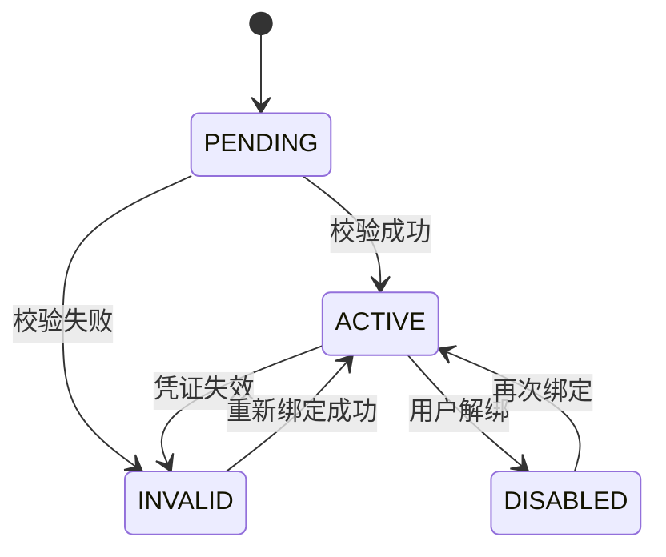

### 8.2 抓取执行状态机

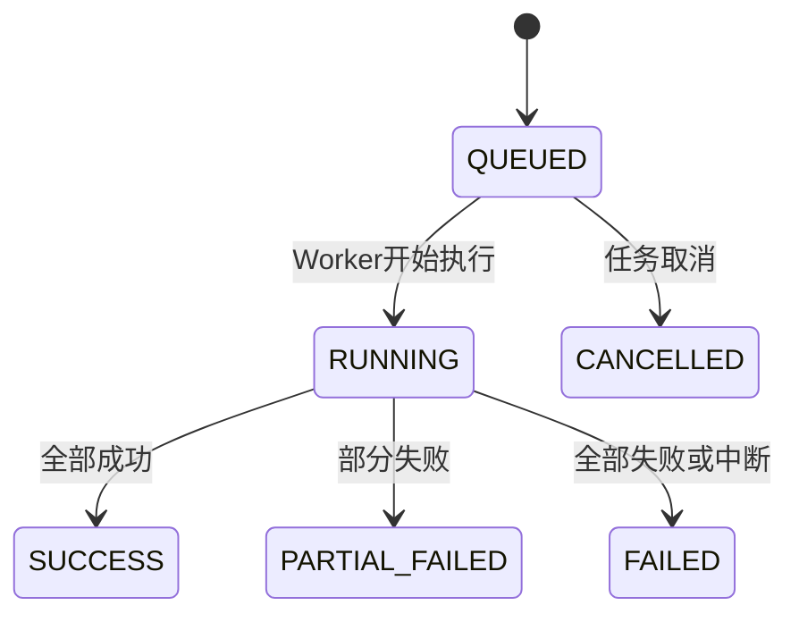

### 8.3 AI 任务状态机

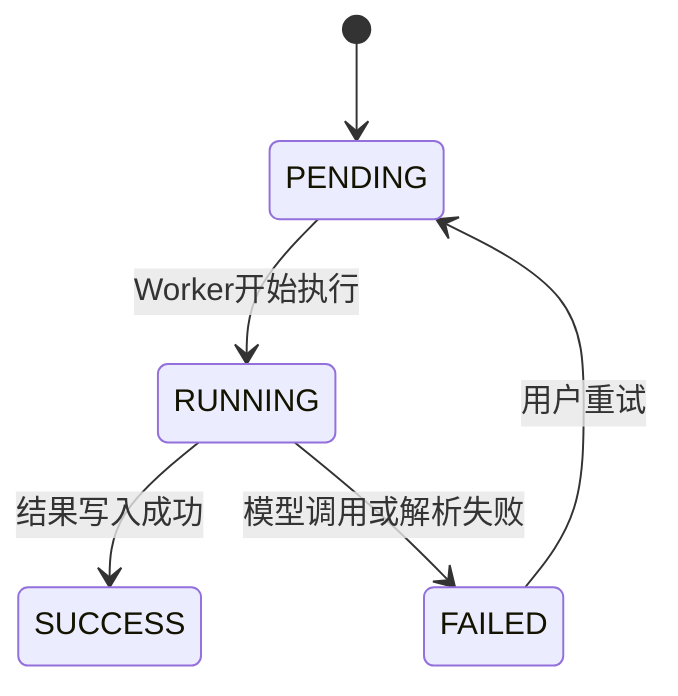

### 8.4 发布任务状态机

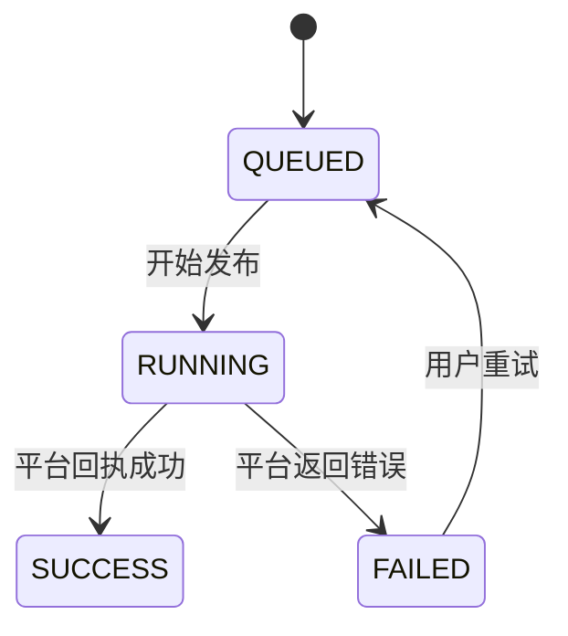

### 8.5 Telegram 投递状态机

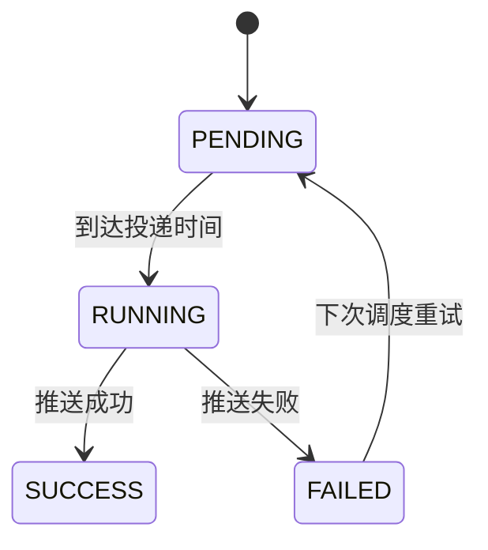

## 9. 异常与补偿设计

### 9.1 常见异常

1. 凭证失效
2. 抓取限流
3. 网络超时
4. X 页面结构变化
5. 数据库唯一约束冲突
6. 富文本解析异常
7. AI 模型调用失败或返回格式异常
8. 目标发布平台返回发布失败
9. Telegram 推送失败

### 9.2 处理策略

1. 凭证失效：绑定状态置为 `INVALID`，暂停后续自动抓取。
2. 网络超时：当前任务记为失败，保留错误详情，等待下次自动执行。
3. 唯一约束冲突：视为已归档，当前处理项记为 `SKIPPED`。
4. 单条帖子解析失败：任务状态可降级为 `PARTIAL_FAILED`，不影响其他帖子处理。
5. AI 调用失败：保留帖子主归档数据，AI 任务状态记为 `FAILED`，允许后续重试。
6. 发布失败：保留草稿，发布任务状态记为 `FAILED`，允许选择单渠道重试。
7. Telegram 推送失败：记录失败原因，不影响原始归档和报告数据。

### 9.3 补偿机制

1. 支持手动触发重新抓取。
2. 可根据 `crawl_run_posts` 中的失败项实现后续重试能力。
3. 原始载荷保留在数据库中，便于后续重新解析富文本。
4. AI 任务支持按帖子、按报告、按批次重试。
5. 发布任务支持按渠道重试。

## 10. 部署与运维设计

### 10.1 推荐部署

1. Next.js：部署在 Vercel
2. NestJS API + Scheduler + Worker：部署在 Docker 容器
3. PostgreSQL：部署在 Neon

### 10.2 环境变量

1. `DATABASE_URL`
2. `NEXTAUTH_SECRET`
3. `NEXTAUTH_URL`
4. `INTERNAL_API_BASE_URL`
5. `INTERNAL_API_SHARED_SECRET`
6. `CREDENTIAL_ENCRYPTION_KEY`
7. `CRAWLER_ADAPTER_NAME`
8. `AI_PROVIDER_DEFAULT_TIMEOUT_MS`
9. `TELEGRAM_BOT_TOKEN`
10. 各 AI 与发布平台接入所需密钥环境变量或 KMS 配置

### 10.3 日志与监控

1. 所有 `crawl_runs` 需要记录状态与统计结果。
2. Worker 运行日志应带 `bindingId`、`crawlRunId` 便于定位。
3. 错误日志中不得输出完整敏感凭证。
4. AI 调用日志应带 `taskType`、`modelConfigId`。
5. 发布任务日志应带 `draftId`、`channelBindingId`。
6. Telegram 投递日志应带 `subscriptionId`。

## 11. 后续演进建议

1. 将抓取、AI、发布和订阅任务统一演进为 BullMQ 队列。
2. 引入全文检索能力，支持帖子正文检索。
3. 增加内容评分、选题推荐与 AI 润色策略。
4. 逐步扩展更多发布渠道与更多抓取源平台。
